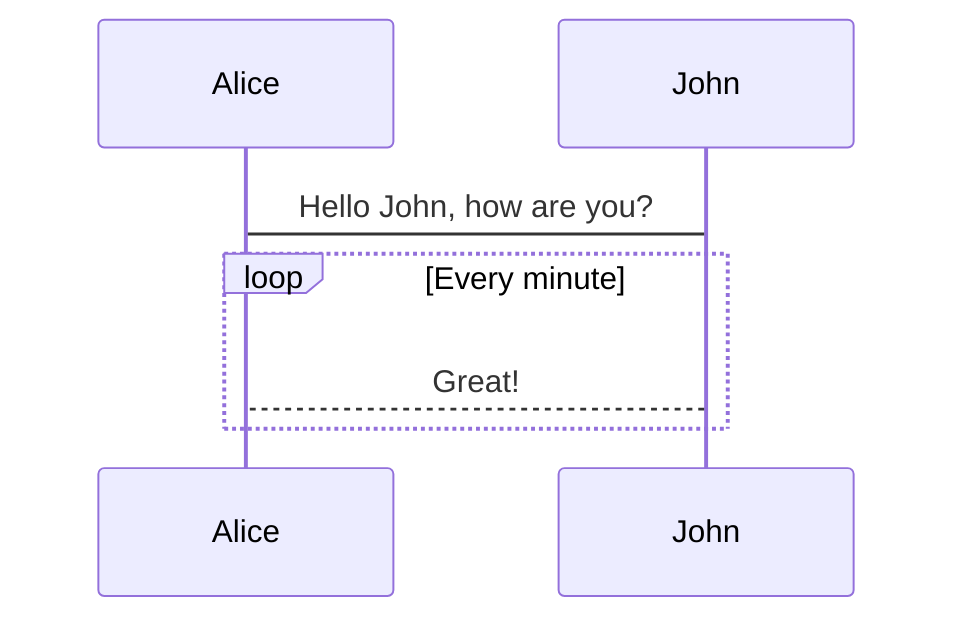

# Core Docs

> `@nrk/core-docs` makes it easy to write documentation for your project in [markdown](https://github.com/markedjs/marked) and
> render it beautifully.

## Getting started

Core Docs can parse and render all markdown files you put in your directory. The only requirement, is an `index.html` in which you declare the menu as an `<ul>` and load `@nrk/core-docs`. Link to your markdown files using their relative path, prepended with `?`. Example:

```html
<!DOCTYPE html>
<ul>
  <li><a href="?readme.md">Core Docs</a></li>
  <li><a href="?example/readme.md">Nested</a></li>
  <li><a href="?example/thing.md">More Docs</a></li>
  <li class="docs-menu-break"><a href="https://github.com/nrkno/core-docs">View on Github</a></li>
  <li><a href="https://github.com/nrkno/core-docs/releases">View changelog</a></li>
  <li><a href="#" download>Download example</a></li>
</ul>
<script src="https://static.nrk.no/core-docs/major/4/core-docs.min.js" charset="utf-8"></script>
```

A `<nav>` can also be used in place of `<ul>` in cases where more granular control over the side navigation is preferable.

### Example structure

```
├── example
│   ├── readme.md
│   └── thing.md
├── index.html
└── readme.md
```

### External links

Add links to code repo, changelog and other useful places for your project to make the documentation a central go-to place for your project.
Links containing `github.com` will get a GitHub icon and links with the `download` attribute will get a download icon.

## Syntax highlighting

Your markdown code can be automatically highlighted by prefixing code blocks with the language extension,
like we do with <code>```html</code>. Core Docs uses [hljs (highlight.js)](https://highlightjs.org) under the hood.

For instance you write:

````
```html
<ul>
  <li><button>Chrome</button></li>
  <li><button>Firefox</button></li>
  <li><button>Opera</button></li>
  <li><button>Safari</button></li>
  <li><button>Microsoft Edge</button></li>
</ul>
````

to get HTML highlighting colors:

```html
<ul>
  <li><button>Chrome</button></li>
  <li><button>Firefox</button></li>
  <li><button>Opera</button></li>
  <li><button>Safari</button></li>
  <li><button>Microsoft Edge</button></li>
</ul>
```

## Demos

You can write an inline demo in your markdown by prepending
your `html` code block with `<!-- demo -->`. Demos supports HTML, CSS and JavaScript (ES5, ES6 and JSX) all the way back to IE9!
Example:

````
```html
<!-- demo -->
<style>
  #press-button { padding: .3em; font-size: inherit; }
</style>
<button id="press-button" type="button">Press me</button>
<script>
  document.addEventListener('click', event => {
    if (event.target.id === 'press-button') alert('You pressed me')
  })
</script>
```
````

becomes:

```html
<!-- demo -->
<style>
  #press-button {
    padding: 0.3em;
    font-size: inherit;
  }
</style>
<button id="press-button" type="button">Press me</button>
<script type="text/javascript">
  document.addEventListener('click', event => {
    if (event.target.id === 'press-button') alert('You pressed me')
  })
</script>
```

## React

You can also use React to render demos out of the box.

<script src="https://static.nrk.no/core-components/latest/core-toggle/core-toggle.jsx.js"></script>

```html
<!--demo-->
<div id="jsx-toggle-default"></div>
<script type="text/javascript">
  ReactDOM.render(
    <>
      <button type='button'>Toggle JSX</button>
      <CoreToggle hidden onToggle={console.log}>
        Content
      </CoreToggle>
    </>,
    document.getElementById('jsx-toggle-default')
  )
</script>
```

## Tabs

To render all `<h4>` headings as tabs, set the `tabs` option to `true` in the `index.html` containing the menu:

```html
<ul>
  ...
</ul>
<script>
  window.coreDocs = {
    tabs: true, // Enable automatic tabs
  }
</script>
<script src="https://static.nrk.no/core-docs/latest/core-docs.min.js" charset="utf-8"></script>
```

All level 4 headings are then automatically converted to tabs. Content after a heading level 4 will be put in the correlating tab panel, unless it is a heading level 1, heading level 2, horizontal ruler, or new heading level 4. For example this:

```markdown
#### Introduction

This is the introduction. It contains some text.

#### Details

Here are the details.

### More

More details

#### Last

The end
```

becomes:

#### Introduction

This is the introduction. It contains some text.

#### Details

Here are the details.

### More

More details

#### Last

The end

## Theme

Core-docs has support for a light (default) and dark theme.

### Setup

To turn on theme switching, set the `theme` option to `true` or assign an object to override default options:

```html
<ul>
  ...
</ul>
<script>
  window.coreDocs = {
    theme: {
      label: 'Dark theme', // theme input[type="checkbox"] label (default: 'Dark theme')
      prefers: true, // use system settings for light or dark mode (default: true)
    },
  }
</script>
<script src="https://static.nrk.no/core-docs/latest/core-docs.min.js" charset="utf-8"></script>
```

### Theme selection

Core-docs defaults to the light theme.

When the `theme.prefers` option is `true`, Core-docs checks for preferences in system settings to select a theme and will listen for changes in these settings and update accordingly (both user initiated or through features like the Auto Appearance in Mac OS).

When a user makes a selection by pressing the toggle, that choice takes presedence for the remainder of the session and will ignore any changes to the system theme settings. The selection is stored in the browsers `sessionStorage` and will disappear when closing the window or tab.

### Custom theme styles

Use theme conditioned classes `{{ 'button-light' : 'button-dark' }}` to apply custom theme styles:

```html
<!-- demo -->
<style>
  #demo-button {
    padding: 0.3em;
    font-size: inherit;
  }
</style>
<button type="button" id="demo-button" class="{{ 'button-light' : 'button-dark' }}">Press me</button>
<script>
  document.addEventListener('click', event => {
    if (event.target.id === 'demo-button') alert('You pressed me')
  })
</script>
```

### Specify your own theme

If you want to override core-docs default themes, you can override the default CSS color profile. The following CSS Custom properties controls core-docs `light` and ` dark` theme:

```CSS
:root {
  /* Values for light/default theme */
  --docs-color-background--light: #fff;
  --docs-color-background-code--light: #f4f4f4;
  --docs-color-text--light: #141517;
  --docs-color-link--light: #0059b3;
  --docs-color-border--light: #eee;
  --docs-color-shadow--light: #00b9f2;

  /* Values for dark theme */
  --docs-color-background--dark: #36363b;
  --docs-color-background-code--dark: #1d1d21;
  --docs-color-text--dark: #f7f4f2;
  --docs-color-link--dark: #b2cff5;
  --docs-color-border--dark: #1d1d21;
  --docs-color-shadow--dark: hsla(210, 15%, 50%, 0.4);
}
```

Default styles for core docs are defined as `@layer core-docs` ([cascade layer](https://developer.mozilla.org/en-US/docs/Learn/CSS/Building_blocks/Cascade_layers)). Any overriding un-layered styles have higher presidence independent of stylesheet order in the document.

_Please note that overriding the `docs-code-background--light` or `docs-code-background--dark` colors will likely lead to contrast issues, and we do not recommend adjusting these. Minor adjustments to hljs theme [A 11 Y Light](https://highlightjs.org/static/demo/) was necessary to be WCAG compliant with `docs-code-background--light`. Thus hljs colors deviate from what is presented in native docs._

## Mermaid

You can add support for [mermaid](https://mermaid-js.github.io/mermaid) diagrams and visualizations by adding this html snippet after the core-docs script tag.

```html
<script type="module">
  import mermaid from 'https://unpkg.com/mermaid@9/dist/mermaid.esm.min.mjs'
  const theme = document.documentElement.getAttribute('data-theme') === 'dark' ? 'dark' : 'default'
  mermaid.initialize({ startOnLoad: true, theme })
</script>
```


